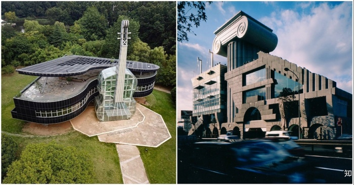
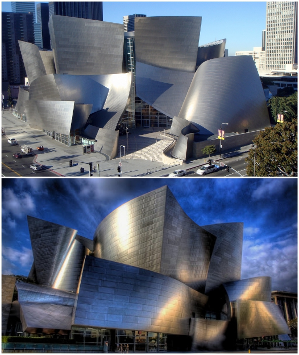
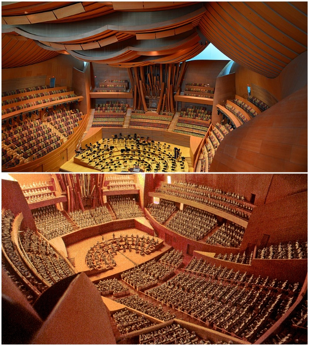
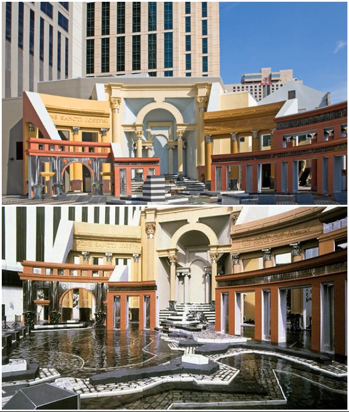
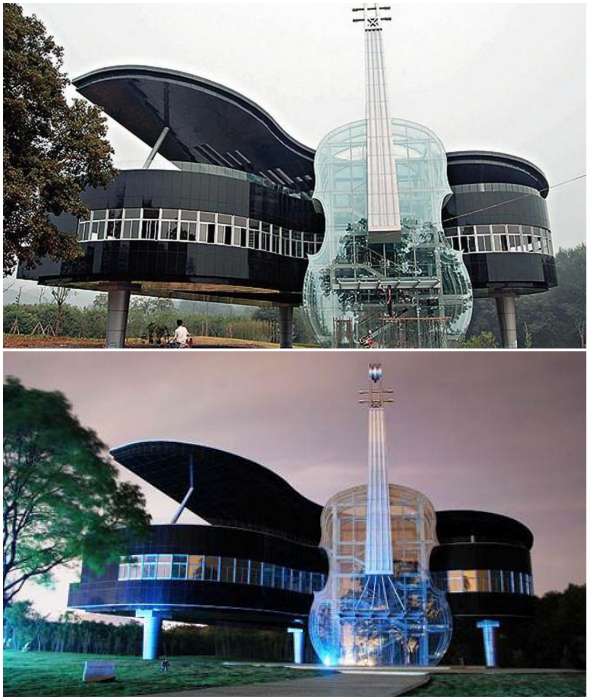

# Weirdness and dynamism: 5 striking examples of postmodern architecture

## M2 showroom for Mazda in Tokyo, Japan

Although architect Kengo Kuma was not a follower of postmodernism, his design of the Mazda M2 showroom is considered a prime example of collage style in design. The Japanese architect with his creation decided "to restore the tradition of creating ancient buildings and rethink their canons for the XXI century". And he succeeded in doing so perfectly, because the M2 building quickly became a landmark and a style icon. Although initially there were plenty of critics concerning the composition.

## Walt Disney Concert Hall in Los Angeles (USA).

A prime example of the new style was the Walt Disney Concert Hall, created for the Los Angeles orchestra and main chorale. The creator of this fantasy facility is Frank Gehry, the most recognizable postmodern architect whose work has become an icon of style and a hallmark of the cities where it was realized. His organic forms are inspired by soaring sails frozen in time.

In addition to its truly unique design aesthetic, the building is known for its acoustics. Acoustic designer Yasuhisa Toyota was able to create a special concert hall area to achieve perfect sound when designing the curved interiors, which matched the unusual metal cladding of the building.

Noteworthy: The massive building and its many metal sails are covered with more than 12,000 stainless steel panels.

## Piazza d'Italia in New Orleans (Louisiana, USA)

Piazza d'Italia is a playful rendition of a traditional Italian square in New Orleans, Louisiana, USA. Unusual in every way the object was designed by Charles Moore. The creator decided to show what influence the Italian culture had on New Orleans in such a fairy-tale way.

Of course, many people didn't accept the brightly colored facade, which repeated the forms of classical architecture, but, according to the author, he didn't mock the classical canons, but wanted to show the true triumph of Italian innovation in the arts. But despite the good intentions of the creator of the extraordinary public square, its bold design had a direct impact on the fate of the object.

## A grand piano and violin house in Huainan, China

Not only famous creators have made a name for themselves in the postmodernism scene. In 2007, students of Hefei University of Technology, together with the Huainan Fangkai Decoration Project Co. architectural studio, succeeded in surprising the world with another object that really delighted with its aesthetics and functionality. Through their efforts a real art object in the form of a giant piano and violin appeared in the city. But this was no props or art for beauty's sake, but a real building, including an exhibition hall for cultural events, classrooms, and an unusual staircase placed inside the violin.

